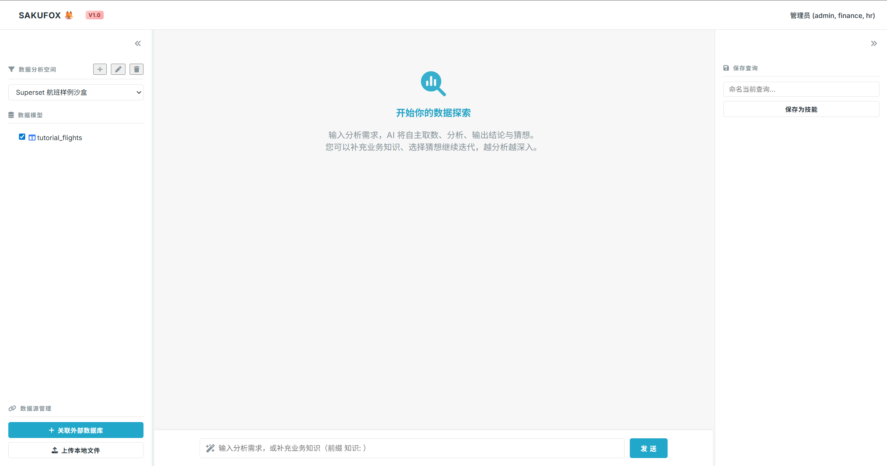
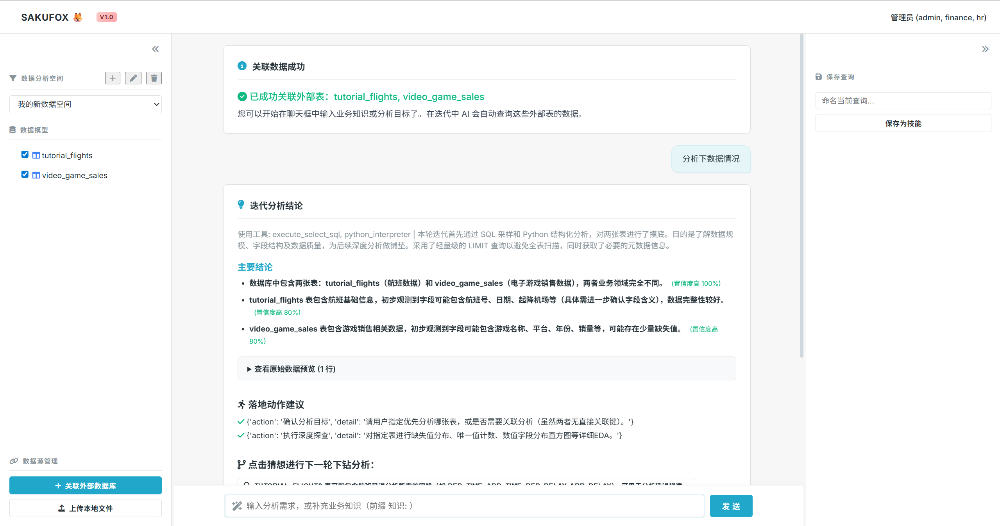

# SakuFox 🦊: The Agile Intelligent Data Analyst

> **Saku (樱花) for elegance, Fox (狐狸) for precision. Catching core insights from your data with ninja-like agility.**

SakuFox is a robust, secure, and interactive data workspace. Inspired by the resilience of the cherry blossom (from *Dragon Raja*'s Sakurakoji) and the sharp intuition of a fox, it transforms complex multi-source data into crystal-clear insights using an advanced agentic core.




---

## ✨ Key Features

### 📁 **Persistent Workspaces (Sandboxes)**
Move beyond ephemeral sessions. Create, name, and manage dedicated Workspaces for different projects.
*   **Isolation**: Each workspace maintains its own set of database connections, uploaded files, and business knowledge.
*   **Context Persistence**: Switch between workspaces without losing your analysis state.

### 🔗 **Unified Data Context**
Bring all your data sources into a single checkable context for the AI:
*   **Multi-DB Support**: Connect to SQLite, PostgreSQL, and more via a unified connection modal.
*   **Selective Schema**: Pick exactly which tables (up to 5) to expose to the LLM to maintain high precision and stay within context limits.
*   **Large File Analysis**: Upload `CSV`, `Excel`, `JSON`, or `TXT` files. The backend stores them on disk and uses **Pandas** to analyze them natively, supporting millions of rows without truncation.

### 🧠 **Autonomous Iterative Agent**
The agent doesn't just return a table; it performs a full analytical loop:
*   **Thought Streaming**: Watch the AI's internal reasoning as it plans its approach.
*   **Dual-Engine Logic**: The agent automatically chooses between **SQL** (for retrieval) and **Python** (for deep statistical processing and visualization).
*   **Dynamic Visualizations**: Automatically generates interactive **ECharts** visualizations based on the data findings.

### 🛡️ **Enterprise Security & Control**
*   **Business Knowledge Persistence**: Supplement the AI's understanding with domain-specific rules that persist within the Workspace.
*   **Permission Whitelisting**: Tables and documents are only accessible if they match the user's group permissions.
*   **Sandbox Security**: Python code is executed in a controlled environment to ensure system stability.

---

## 🚀 Quick Start

### Prerequisites
*   Python 3.10+
*   A modern web browser (Chrome/Edge/Firefox)

### Installation

1.  **Environment Setup**
    ```bash
    # Create and activate virtual environment
    python -m venv .venv
    .\.venv\Scripts\activate  # Windows
    # source .venv/bin/activate # Mac/Linux
    
    # Install dependencies
    pip install -r requirements.txt
    ```

2.  **Configuration**
    *   Initialize `app/config.py` (copy from `app/config.example.py`).
    *   Set your LLM provider (`openai`, `anthropic`, or `mock` for testing).

3.  **Run Application**
    ```bash
    python -m uvicorn app.main:app --reload
    ```

4.  **Access Dashboard**
    *   Visit `http://localhost:8000/web/dashboard.html`.
    *   Log in (e.g., username `admin` for LDAP demo).
    *   Create a new **Workspace**, connect a database, and start asking!

---

## 🏗️ Technical Architecture

*   **Backend**: [FastAPI](https://fastapi.tiangolo.com/) + [SQLAlchemy](https://www.sqlalchemy.org/)
    *   **Agent**: Custom state-machine agent with tool-calling capabilities.
    *   **Data Tier**: [Pandas](https://pandas.pydata.org/) for high-performance file analysis.
*   **Frontend**: Vanilla JavaScript + CSS (Premium Dark/Glassmorphism aesthetic)
    *   **Charts**: [Apache ECharts](https://echarts.apache.org/)
    *   **Markdown**: [Marked.js](https://marked.js.org/)

## 📝 Core API Endpoints

| Method | Endpoint | Description |
| :--- | :--- | :--- |
| `POST` | `/api/chat/iterate` | Streamed. Main analytical loop for SQL/Python generation. |
| `POST` | `/api/sandboxes` | CRUD for persistent Workspace management. |
| `POST` | `/api/data/upload` | Upload local files directly into Workspace disk storage. |
| `POST` | `/api/chat/feedback` | Persist business knowledge/rules to the active Workspace. |
| `GET`  | `/api/sandboxes/{id}/db-tables` | Fetch and select available schemas from an external DB. |

---

## 🤝 Contributing

Contributions are welcome! Please submit a Pull Request or open an issue for feature requests.

